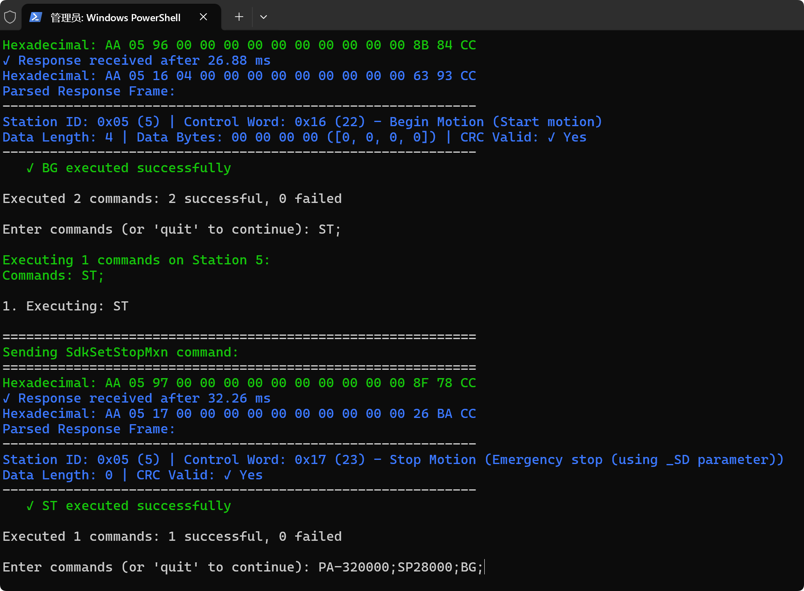
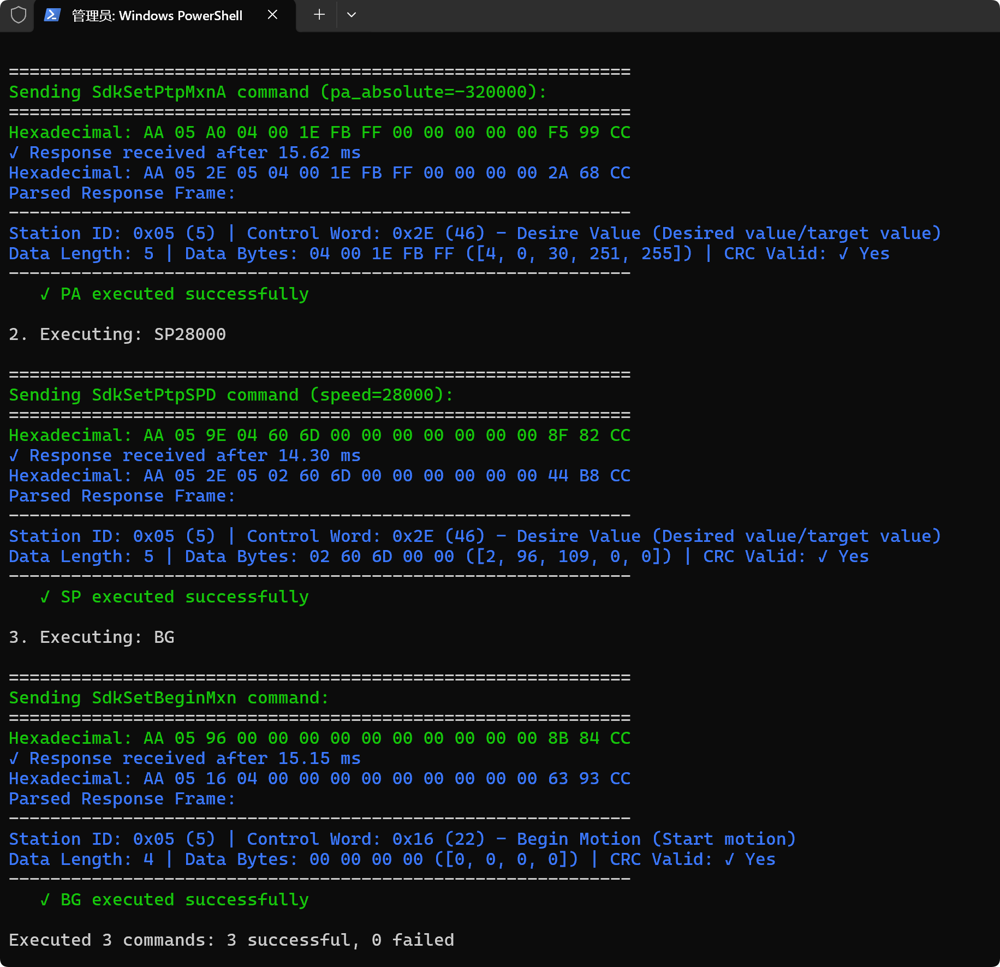

# UIM2513 Gateway and UIM342 Motor Control Python SDK

A comprehensive Python SDK for serial communication with UIM2513 Gateway and UIM342/UIM720 motor controllers. This SDK provides a complete set of functions for motor control, configuration, and monitoring through asynchronous serial communication.


## Table of Contents

- [Features](#features)
- [Requirements](#requirements)
- [Installation](#installation)
- [Quick Start](#quick-start)
- [Project Structure](#project-structure)
- [Configuration](#configuration)
- [API Reference](#api-reference)
- [Usage Examples](#usage-examples)
- [Troubleshooting Guide](#troubleshooting-guide)
- [Reference Documents](#reference-documents)
- [License](#license)
- [Support](#support)

## Features

- **Asynchronous Serial Communication**: Built on `asyncio` and `pyserial-asyncio` for efficient non-blocking I/O
- **Complete SDK Functions**: Comprehensive set of motor control and configuration functions
- **Automatic Station Detection**: Automatically detects and assigns motor station IDs based on detected devices
- **Dual Motor Support**: Support for controlling multiple motors simultaneously with automatic single/dual motor mode detection
- **Error Handling**: Robust error handling with custom exceptions
- **Emergency Safety Cleanup**: Automatic motor safety shutdown (stop, disable, lock brake) on program exit
- **Response Parsing**: Automatic parsing of device responses with detailed information
- **Error Report Parsing**: Detailed parsing and display of device error reports with error codes, source commands, and troubleshooting information
- **Control Word Parsing**: Parse and interpret control words to identify command types and flags
- **Motion Status Flags Parsing**: `parse_motion_status_flags` parses SdkGetMotionStatus (command_index=0) ms0/ms1 into d0/d1 bits with raw values and human-readable descriptions; output format `raw (desc)`; ERR/TLIF trigger warning lines
- **Port Management**: Automatic serial port detection and configuration persistence
- **Real-time Notifications**: Support for real-time motion status and DIO port notifications
- **Motor Control Helpers**: High-level helper functions for common motor operations
- **Input Logic Configuration**: Configure input triggers and actions for motor control

## Requirements

- Python 3.7 or higher
- **Supported Operating Systems:**
  - Windows 10/11
  - Ubuntu (Linux)
  - macOS
- UIM2513 Gateway device
- UIM342/UIM720 motor controllers
- Serial port connection (USB-to-Serial adapter or direct serial connection)

## Installation

### Windows

Install required dependencies:
```bash
pip install -r config/requirements.txt
```

Or install manually:
```bash
python -m pip install "pyserial>=3.5" "pyserial-asyncio>=0.6"
```

### Ubuntu (Linux)

1. Install Python dependencies:
```bash
pip install -r config/requirements.txt
```

2. Add user to dialout group for serial port access (requires logout/login to take effect):
```bash
sudo usermod -a -G dialout $USER
```

3. Alternatively, run with sudo if you don't want to add user to dialout group:
```bash
sudo python src/main.py
```

**Note:** On Ubuntu, serial ports are typically named `/dev/ttyUSB0`, `/dev/ttyACM0`, or `/dev/ttyS0` instead of `COM1`, `COM2`, etc. on Windows.

### macOS

1. Install Python dependencies:
```bash
pip install -r config/requirements.txt
```

2. Run the program:
```bash
python src/main.py
```

**Note:** On macOS, serial ports are typically named `/dev/tty.usbserial-*` or `/dev/cu.usbserial-*`. USB-to-Serial adapters may require driver installation (e.g., CH340, FTDI, CP210x drivers).

**Dependencies:**
- **pyserial**: Provides serial port access functionality
- **pyserial-asyncio**: Provides asynchronous serial port support for asyncio

**Version Requirements:**
- Python 3.7 or higher
- pyserial 3.5 or higher
- pyserial-asyncio 0.6 or higher

**Updating Dependencies:**
To update dependencies, edit `requirements.txt` and run:
```bash
pip install -r config/requirements.txt --upgrade
```

## Quick Start

### Basic Usage

1. **Run the Example**:
```bash
python src/main.py
```

2. **Select Serial Port**: The program will automatically detect available serial ports. Select the port connected to your UIM2513 Gateway.

3. **Automatic Station Detection**: The program will automatically:
   - Detect all connected motor stations (excluding gateway)
   - Assign station IDs based on the number of motors detected:
     - **1 motor**: Assigned to `STATION_ID_X`
     - **2 or more motors**: Smaller station ID → `STATION_ID_X`, Larger station ID → `STATION_ID_Y`
   - Display station configuration information and wait for user confirmation
   - Automatically skip dual motor control if only 1 motor is detected

**Note**: Station IDs are now automatically assigned. You no longer need to manually configure `STATION_ID_X` and `STATION_ID_Y` in `src/main.py`. The program will detect and assign them based on the actual connected devices.

### Simple Example

```python
import asyncio
import serial_asyncio
from src.protocol import SerialProtocol
from src.sdk_functions import SDKClient, set_sdk_client, SdkSetMotorOn, SdkGetML
from src.constants import DEFAULT_BAUDRATE

async def main():
    # Open serial port
    transport, protocol = await serial_asyncio.create_serial_connection(
        SerialProtocol,
        'COM3',  # Your serial port
        baudrate=DEFAULT_BAUDRATE
    )
    
    # Initialize SDK client
    client = SDKClient(transport, protocol)
    set_sdk_client(client)
    
    # Wait for initialization
    await asyncio.sleep(0.1)
    
    # Get motor list
    response = await SdkGetML(0)  # Broadcast to all stations
    if response:
        print(f"Found {len(response)} stations")
    
    # Enable motor (station ID = 11)
    response = await SdkSetMotorOn(11, 1)
    if response:
        print("Motor enabled successfully")
    
    # Close connection
    transport.close()

if __name__ == "__main__":
    asyncio.run(main())
```

## Project Structure

```
.
├── src/
│   ├── main.py                           # Main example script
│   ├── sdk_functions.py                  # SDK function implementations
│   ├── protocol.py                       # Serial protocol handler
│   ├── parsers.py                        # Response parsers, validation, and error report parsing
│   ├── constants.py                      # Constants, command codes, and error codes
│   ├── utils.py                          # Utility functions
│   ├── motor_control_helpers.py          # Motor control helper functions
│   ├── serial_port_config.py             # Serial port configuration management
│   └── exceptions.py                     # Custom exceptions
├── config/
│   ├── requirements.txt                  # Python dependencies
│   └── serial_port_config.json           # Serial port configuration
└── README.md                             # This file (complete documentation)
```

**Key Modules:**

- **`parsers.py`**: Contains response parsing functions including:
  - `parse_control_word()`: Parse Control Word to get command name and flags
  - `parse_motion_status_flags()`: Parse SdkGetMotionStatus (command_index=0) ms0/ms1 into d0/d1 bits (raw and `*_desc`)
  - `parse_dio_port_response()`: Parse DIO port (DI) response (inputs/outputs)
  - `parse_il_response()`: Parse Input Logic (IL) response
  - `_parse_error_code()`: Parse error codes from Error Report responses
  - `_print_error_report()`: Display detailed Error Report information
  - `_print_data_length_mismatch()`: Handle and display unexpected response diagnostics
  - `_print_sdk_return_value()`: Format and display SDK function results

- **`constants.py`**: Defines all protocol constants including:
  - Command codes (`__ER`, `__ML`, `__MT`, etc.)
  - Error codes (`ERR_INS_SYNT`, `ERR_MXN_MOFF`, etc.)
  - Configuration indices (`ICFG_AMO_IDX`, `MTS_BRK_IDX`, etc.)
  - Real-time notification codes (`RTCN_MXN_INP`, `RTCN_DIO_P1L`, etc.)

## Configuration

### Serial Port Configuration

The SDK automatically saves your serial port selection to `config/serial_port_config.json`. On subsequent runs, it will attempt to auto-connect to the previously selected port.

**File Format:**
```json
{
  "selected_index": 3,
  "selected_port": "COM3",
  "timestamp": 1234567890.123
}
```

**Fields:**
- `selected_index`: Index of the selected port (1-based, matches the port list)
- `selected_port`: Name of the selected port (e.g., "COM3" on Windows)
- `timestamp`: Unix timestamp when the port was selected

**Usage:**
- The SDK automatically loads this configuration on startup
- If a saved configuration exists, the SDK will attempt to auto-connect to the saved port
- You can manually edit this file, but it's recommended to use the SDK's port selection interface

**Location:** `config/serial_port_config.json`

**Configuration Management:**
1. **First Run**: No configuration exists, user selects port manually
2. **Subsequent Runs**: SDK attempts to auto-connect using saved configuration
3. **Connection Failure**: User is prompted whether to reselect port (y/n)
4. **Manual Selection**: User can always manually select a different port

**Program Startup Flow:**
1. **Serial Port Selection**: User selects or auto-connects to a serial port
2. **Serial Port Connection**: SDK opens the serial port connection
3. **Connection Failure Handling**: If connection fails, user is asked whether to reselect port
4. **Message Printing Configuration**: After successful connection, user is prompted to enable/disable message printing for debugging
5. **Communication Start**: SDK begins communication with the device

**Manual Configuration:**
You can manually edit `serial_port_config.json` if needed. Ensure the port index matches an available port. The SDK will validate the configuration on startup.

### Station IDs

**Automatic Station Detection and Assignment**

The program automatically detects and assigns motor station IDs when it starts:

1. **Station Detection**: On startup, the program broadcasts `SdkGetML(0)` to detect all connected devices
2. **Gateway Filtering**: The gateway station (ID: 3) is automatically filtered out (not a motor device)
3. **Automatic Assignment**:
   - **1 motor detected**: Assigned to `STATION_ID_X`, `STATION_ID_Y` = 0 (dual motor control skipped)
   - **2 or more motors detected**: 
     - Smaller station ID → `STATION_ID_X`
     - Larger station ID → `STATION_ID_Y`
     - Dual motor control enabled
4. **User Confirmation**: Station configuration is displayed and user must confirm before proceeding

**Station ID Range**: Station IDs range from 0-126, where 0 is used for broadcast commands to all stations.

**Manual Configuration** (Optional): If you need to manually set station IDs, edit `src/main.py`:
```python
STATION_ID_X: int = 0  # X-axis motor station ID (auto-assigned)
STATION_ID_Y: int = 0  # Y-axis motor station ID (auto-assigned)
```
However, these values will be overwritten by automatic detection. Manual configuration is not recommended.

### Communication Parameters

Default communication parameters are defined in `src/constants.py`:
- **Baudrate**: 57600 (default)
- **Timeout**: 1.0 seconds (default)
- **Gateway Station ID**: 3 (not a real device station)
- **PTP Motion Timeout**: 
  - Single motor: 3.0 seconds (default)
  - Dual motor: 10.0 seconds (default)
- **S1 Trigger Timeout**: 10.0 seconds (default for home positioning)

**Safety Features:**
- **Emergency Cleanup**: On program exit (normal or abnormal), motors are automatically:
  - Stopped (speed set to zero)
  - Disabled (motor off)
  - Brake locked (brake on)
- **S1 Timeout Handling**: If S1 trigger times out during `goto_home`, the motor is automatically stopped before continuing

You can modify these values as needed for your setup.

### Dependencies

Python dependency package configuration file is located at `config/requirements.txt`. See [Installation](#installation) section for installation instructions and dependency details.


For troubleshooting configuration issues, see [Troubleshooting Guide](#troubleshooting-guide).

## API Reference

Complete API reference for UIM2513 Gateway and UIM342 Motor Control Python SDK.

### SDK Client

The `SDKClient` class manages serial transport and protocol instances:

```python
from src.sdk_functions import SDKClient, set_sdk_client

client = SDKClient(transport, protocol_instance)
set_sdk_client(client)  # Set global client for SDK functions
```

**Methods:**
- `send_and_receive(send_data, description, timeout=None)`: Send command and wait for single response
- `send_and_receive_multiple(send_data, description, timeout=1.0, max_responses=255)`: Send command and wait for multiple responses

### Motor List Functions

#### `SdkGetML(station_id: int) -> Union[Optional[Dict], Optional[List[Dict]]]`

Get motor list. Use station_id=0 for broadcast to all stations.

**Parameters:**
- `station_id`: Station ID (0-126), use 0 for broadcast

**Returns:**
- Single station: Dictionary with station information
- Broadcast (0): List of dictionaries, one per responding station

**Example:**
```python
response = await SdkGetML(0)  # Broadcast to all stations
if isinstance(response, list):
    for station in response:
        print(f"Station ID: {station['station_id']}")
```

### Configuration Functions

#### `SdkGetInitialConfig(station_id: int, command_index: int) -> Optional[Dict]`

Get initial configuration parameter.

**Parameters:**
- `station_id`: Station ID (0-126)
- `command_index`: Configuration index

**Command Indices:**
- `ICFG_AMO_IDX`: Auto Motor On
- `ICFG_ACM_IDX`: Auto Clear Motion

#### `SdkGetMotorConfig(station_id: int, command_index: int) -> Optional[Dict]`

Get motor configuration parameter.

**Parameters:**
- `station_id`: Station ID (0-126)
- `command_index`: Configuration index

**Command Indices:**
- `MTS_BRK_IDX`: Brake configuration
- `MTS_MCS_IDX`: Motor current setting
- `MTS_CUR_IDX`: Current limit
- `MTS_PSV_IDX`: Position servo mode

#### `SdkSetMotorConfig(station_id: int, command_index: int, value: int) -> Optional[Dict]`

Set motor configuration parameter.

**Parameters:**
- `station_id`: Station ID (0-126)
- `command_index`: Configuration index
- `value`: Configuration value (0-65535)

**Example:**
```python
# Enable brake
await SdkSetMotorConfig(11, MTS_BRK_IDX, 1)

# Release brake
await SdkSetMotorConfig(11, MTS_BRK_IDX, 0)
```

### Motor Control Functions

#### `SdkSetMotorOn(station_id: int, enable: int) -> Optional[Dict]`

Enable or disable motor.

**Parameters:**
- `station_id`: Station ID (0-126)
- `enable`: 1 to enable, 0 to disable

**Example:**
```python
await SdkSetMotorOn(11, 1)  # Enable motor
await SdkSetMotorOn(11, 0)  # Disable motor
```

#### `SdkSetJogMxn(station_id: int, speed_value: int) -> Optional[Dict]`

Set jog motion speed.

**Parameters:**
- `station_id`: Station ID (0-126)
- `speed_value`: Signed speed value (-32768 to 32767)
  - Positive: Forward direction
  - Negative: Reverse direction

#### `SdkSetBeginMxn(station_id: int) -> Optional[Dict]`

Begin motion execution. This command starts the motion that was previously configured.

**Parameters:**
- `station_id`: Station ID (0-126)

#### `SdkSetStopMxn(station_id: int) -> Optional[Dict]`

Stop motion (decelerating stop).

**Parameters:**
- `station_id`: Station ID (0-126)

#### `SdkSetOrigin(station_id: int) -> Optional[Dict]`

Set current position as origin (home position).

**Parameters:**
- `station_id`: Station ID (0-126)

### PTP Motion Functions

#### `SdkSetPtpMxnA(station_id: int, pa_absolute: int) -> Optional[Dict]`

Set absolute position target for PTP motion.

**Parameters:**
- `station_id`: Station ID (0-126)
- `pa_absolute`: Absolute position target (signed 32-bit integer)

#### `SdkSetPtpMxnR(station_id: int, pr_relative: int) -> Optional[Dict]`

Set relative position target for PTP motion.

**Parameters:**
- `station_id`: Station ID (0-126)
- `pr_relative`: Relative position offset (signed 32-bit integer)
  - Positive: Move forward
  - Negative: Move backward

#### `SdkSetPtpSPD(station_id: int, speed: int) -> Optional[Dict]`

Set PTP motion speed.

**Parameters:**
- `station_id`: Station ID (0-126)
- `speed`: Motion speed (unsigned integer)

#### `SdkGetPtpMxnA(station_id: int) -> Optional[Dict]`

Get current absolute position.

**Parameters:**
- `station_id`: Station ID (0-126)

**Returns:**
- Dictionary containing current absolute position in `data_bytes`

**Example:**
```python
# Move to absolute position 10000 at speed 5000
await SdkSetPtpSPD(11, 5000)
await SdkSetPtpMxnA(11, 10000)
await SdkSetBeginMxn(11)

# Get current position
response = await SdkGetPtpMxnA(11)
if response:
    # Parse position from response data_bytes
    from src.utils import int32_signed_from_bytes
    position_bytes = response['data_bytes']
    current_position = int32_signed_from_bytes(position_bytes)
    print(f"Current position: {current_position}")
```

### Motion Status Functions

#### `SdkGetMotionStatus(station_id: int, command_index: int) -> Optional[Dict]`

Get motion status information.

**Parameters:**
- `station_id`: Station ID (0-126)
- `command_index`: Query index (0 or 1)

**Command Indices:**

| Index | Description | Response Data |
|-------|-------------|---------------|
| 0 | Get Status Flags and Relative Position | ms0, ms1 (status flags) + PR0-PR3 (relative position) |
| 1 | Get Current Speed and Absolute Position | sp0-sp2 (current speed) + PA0-PA3 (absolute position) |

**Response Format:**

- **command_index=0**: `[00] ms0 ms1 00 00 PR0 PR1 PR2 PR3` (8 bytes)
  - `ms0, ms1`: 16-bit status flags (parsed by `parse_motion_status_flags`):
    - **d0 (ms0, low byte)**: bit0~1 Mode (motion mode), bit2 SON (motor driver), bit3 IN1 (IN1 logic level), bit4 IN2 (IN2 logic level), bit5 IN3 (IN3 logic level), bit6 OP1 (OP1 logic level), bit7 n/a
    - **d1 (ms1, high byte)**: bit0 STOP (motor is in stationary), bit1 PAIF (motor is in position), bit2 n/a, bit3 TLIF (motor stall is detected), bit4 n/a, bit5 LOCK (system is locked down), bit6 n/a, bit7 ERR (system error is detected)
    - Parsed `*_desc` fields: SON_desc (ON/OFF), IN1/IN2/IN3/OP1_desc (HIGH/LOW), STOP_desc (Stationary/Moving), PAIF_desc (In position/Not in position), TLIF_desc (Stall detected/OK), LOCK_desc (Locked/Unlocked), ERR_desc (Error/OK). The printed output shows both raw and parsed as `raw (desc)` (e.g. `SON=1 (ON)`, `PAIF=1 (In position)`). When ERR=1 or TLIF=1, a warning line is printed.
  - `PR0-PR3`: 32-bit signed relative position

- **command_index=1**: `[01] sp0 sp1 sp2 PA0 PA1 PA2 PA3` (8 bytes)
  - `sp0-sp2`: 24-bit current speed (pps)
  - `PA0-PA3`: 32-bit signed absolute position

**Example:**
```python
# Get status flags and relative position
response = await SdkGetMotionStatus(station_id, 0)
if response:
    # Response contains status flags and relative position
    print("Status Flags and Relative Position retrieved")

# Get current speed and absolute position
response = await SdkGetMotionStatus(station_id, 1)
if response:
    # Response contains current speed and absolute position
    print("Current Speed and Absolute Position retrieved")
```

### Acceleration/Deceleration Functions

#### `SdkGetAcceleration(station_id: int) -> Optional[Dict]`

Get acceleration parameter.

**Parameters:**
- `station_id`: Station ID (0-126)
#### `SdkGetDeceleration(station_id: int) -> Optional[Dict]`

Get deceleration parameter.

**Parameters:**
- `station_id`: Station ID (0-126)

#### `SdkGetCutInSpeed(station_id: int) -> Optional[Dict]`

Get cut-in speed parameter.

**Parameters:**
- `station_id`: Station ID (0-126)

#### `SdkGetStopDeceleration(station_id: int) -> Optional[Dict]`

Get stop deceleration parameter.

**Parameters:**
- `station_id`: Station ID (0-126)

### Input Logic Functions

Input Logic (IL) allows you to configure actions that are triggered by input signals or special conditions. Each input can be configured with different actions for falling edge (signal goes from HIGH to LOW) and rising edge (signal goes from LOW to HIGH) transitions.

#### `SdkGetInputLogic(station_id: int, input_index: int) -> Optional[Dict]`

Get input logic configuration for a specific input.

**Parameters:**
- `station_id`: Station ID (0-126)
- `input_index`: Input index (0-17)

**Input Indices:**

**Standard Input Ports:**

| Index | Constant | Port Number | Description |
|-------|----------|-------------|-------------|
| 0 | `SCF_S1C_IDX` | S1 | Input port 1 |
| 1 | `SCF_S2C_IDX` | S2 | Input port 2 |
| 2 | `SCF_S3C_IDX` | S3 | Input port 3 |
[ 16] `SCF_STL_IDX` | N/A |On Stall|
[ 17] `SCF_TLC_IDX` | N/A |On TorqueLimit|

**Special Inputs:**


**Returns:**
- Dictionary containing parsed IL information with falling/rising edge actions

#### `SdkSetInputLogic(station_id: int, input_index: int, falling_edge_action: int, rising_edge_action: int) -> Optional[Dict]`

Set input logic configuration.

**Parameters:**
- `station_id`: Station ID (0-126)
- `input_index`: Input index (0-17)
- `falling_edge_action`: Action code on falling edge (0-255)
- `rising_edge_action`: Action code on rising edge (0-255)

**Input Logic Action Code Definitions:**

| Code | Constant | Name | Description |
|------|----------|------|-------------|
| 0x00 | `ILC_NOP_IDX` | Disable | No Action - Input is disabled |
| 0x01 | `ILC_OFF_IDX` | Driver OFF | Turn off the motor driver |
| 0x02 | `ILC_EST_IDX` | Emergent Stop | Emergency stop - immediately stops motor |
| 0x03 | `ILC_DST_IDX` | Decelerating Stop | Decelerating stop - stops motor with deceleration |
| 0x04 | `ILC_OPR_IDX` | Origin + reverse PR | Set current position as origin, then execute reverse position relative motion |
| 0x05 | `ILC_OES_IDX` | Origin + EStop | Set current position as origin, then emergency stop |
| 0x06 | `ILC_ODS_IDX` | Origin + DStop | Set current position as origin, then decelerating stop |
| 0x07 | `ILC_RJV_IDX` | Reverse JV | Reverse jog velocity - continuous motion in reverse direction |
| 0x08 | `ILC_SJV_IDX` | Signed JV | Signed jog velocity - direction depends on input signal level |
| 0x09 | `ILC_RPR_IDX` | Reverse PR | Reverse position relative - move relative position in reverse direction |
| 0x0A | `ILC_SPR_IDX` | Signed PR | Signed position relative - direction depends on sign of position value |
| 0x0B | `ILC_SPA_IDX` | Signed PA | Signed position absolute - move to absolute position, direction depends on sign |
| 0x0F | `ILC_PVT_IDX` | Execute PVT | Execute PVT (Position-Velocity-Time) motion profile |

**Example:**
```python
from src.sdk_functions import SdkSetInputLogic
from src.constants import SCF_S1C_IDX, ILC_EST_IDX, ILC_NOP_IDX

# Configure S1 input: Falling edge = Emergency Stop, Rising edge = No Action
await SdkSetInputLogic(
    station_id=11,
    input_index=SCF_S1C_IDX,
    falling_edge_action=ILC_EST_IDX,
    rising_edge_action=ILC_NOP_IDX
)
```

For more complete examples, see [Input Logic Configuration Examples](#input-logic-configuration-examples) in Usage Examples section.

**Power-On Execution Flag (FG Flag):**

Some input logic configurations support a Power-On Execution Flag (FG Flag). When enabled, the configured action will be executed automatically when the device powers on, if the input condition is met.

The FG flag is part of the input logic configuration and can be set when configuring inputs. Check the response from `SdkGetInputLogic` to see if FG flags are enabled.

**Notes:**

1. **Stall Trigger**: Only available on UIM342. Rising edge action must be 0x00.
2. **Torque Limit Trigger**: Only available on UIM720. Rising edge action represents torque limit percentage (10-300%, i.e., 0x0A to 0x012C).
3. **Emergency Stop**: Immediately stops the motor without deceleration. Use with caution.
4. **Decelerating Stop**: Stops the motor using configured deceleration parameters.
5. **Origin Actions**: Actions that include "Origin" will set the current position as the origin (home position) before executing the stop action.
6. **Signed Actions**: Actions with "Signed" prefix use the sign of the value to determine direction (positive = forward, negative = reverse).

### DIO Port Functions

#### `SdkGetDIOport(station_id: int) -> Optional[Dict]`

Get DIO port status.

**Parameters:**
- `station_id`: Station ID (0-126)

**Returns:**
- Dictionary containing DIO port status information

### Response Format

All SDK functions return a dictionary with the following structure:

```python
{
    'station_id': int,           # Station ID (0-126)
    'control_word': int,         # Control word
    'control_word_info': {       # Parsed control word information
        'command_name': str,
        'command_description': str,
        'is_input_logic': bool,  # True if this is an IL response
        ...
    },
    'data_len': int,             # Data length
    'data_bytes': List[int],     # Raw data bytes
    'crc_valid': bool,           # CRC validation result
    'il_info': {                 # Present if is_input_logic is True
        'input_index': int,
        'falling_edge_action': int,
        'rising_edge_action': int,
        ...
    },
    ...
}
```

### Response Parsing Functions

The SDK provides comprehensive response parsing functions in `parsers.py` for interpreting device responses.

#### Control Word Parsing

The `parse_control_word()` function parses the Control Word from response frames:

```python
from src.parsers import parse_control_word

# Parse a control word value
cw_info = parse_control_word(0x10)  # Motor Configuration command

print(f"Command Name: {cw_info['command_name']}")
print(f"Description: {cw_info['command_description']}")
print(f"Is Response: {cw_info['is_response']}")
```

**Control Word Structure (8 bits):**
- **Bit 7 (MSB)**: Response flag bit (0 = response, 1 = command)
- **Bit 6-0**: Command code

**Supported Commands:**

| Code | Name | Description |
|------|------|-------------|
| 0x0F | Error Report | Error report/error notification |
| 0x0B | Get Model | Get model, function module and firmware version |
| 0x10 | Motor Configuration | Motor driver configuration |
| 0x06 | Power-Up Configuration | Power-up configuration query |
| 0x07 | Inform Enable | Notification enable configuration |
| 0x15 | Motor On/Off | Motor switch control |
| 0x16 | Begin Motion | Start motion |
| 0x17 | Stop Motion | Emergency stop |
| 0x1D | Jog Velocity | Jog speed setting |
| 0x1E | Speed | Speed setting |
| 0x1F | Position Relative | Relative position |
| 0x20 | Position Absolute | Absolute position |
| 0x21 | Origin | Return to origin |
| 0x19 | Acceleration | Acceleration setting |
| 0x1A | Deceleration | Deceleration setting |
| 0x1B | Start Speed | Start Speed (Cut-In Speed) setting |
| 0x1C | Stop Deceleration | Stop Deceleration setting |
| 0x2E | Desire Value | Desired value/target value |
| 0x37 | Digital I/O | DIO port status |
| 0x5A | Real-Time Notification | Real-time notification message |
| 0x11 | Motion Status | Motion status and displacement |
| 0x34 | Input Logic | Input trigger action logic |

#### Error Report Parsing

When the device returns an Error Report (`__ER`, Control Word 0x0F), the SDK automatically parses the error details:

**Error Report Data Format:**

| Byte | Field | Description |
|------|-------|-------------|
| d0 | Error Index | 0 = Latest error, 1+ = Error history |
| d1 | Error Code | Error code (see table below) |
| d2 | Error Source CW | Control Word that caused the error |
| d3 | Sub-Index/Info | Sub-Index or additional info for the error |
| d4~d5 | Factory Use | Reserved for factory use |

**Error Codes:**

| Code | Name | Description |
|------|------|-------------|
| 0x32 | ERR_INS_SYNT | Instruction's Syntax is wrong |
| 0x33 | ERR_INS_NUMB | Instruction's Data are wrong |
| 0x34 | ERR_INS_IDXR | Instruction's Sub-Index is wrong |
| 0x35 | ERR_SYS_STTM | Cannot change system time while motor is running |
| 0x3C | ERR_MXN_DCSD | Stop Deceleration (SD) is slower than Deceleration (DC) |
| 0x3D | ERR_MXN_MRUN | Cannot change or query while motor is running |
| 0x3E | ERR_MXN_MOFF | Cannot BG when motor driver is OFF |
| 0x3F | ERR_MXN_MTSD | Cannot BG when motor is performing Emergency Stop |
| 0x40 | ERR_MXN_BENA | Cannot BG when motor Brake is Locked |
| 0x41 | ERR_MXN_BDIS | Cannot turn off motor driver when Brake is unlocked |
| 0x42 | ERR_MXN_SPOG | Cannot set origin (ABS encoder) when motor is running |
| 0x46 | ERR_PVT_RUNG | Cannot set PV or MP[0] when motor is running |
| 0x47 | ERR_PVT_WPOV | Index of QP/QV/QT exceeds MP[6] |
| 0x48 | ERR_PVT_IOFN | QA Mask not meeting I/O function requirements |
| 0x49 | ERR_PVB_OVFL | PVT buffer overflow |
| 0x4A | ERR_SXP_BUSY | Sx processing not complete, new parameters not accepted |

**Example Error Report Output:**

When an unexpected response (Error Report) is received, the SDK displays detailed error information:

```
  Station ID: 1
  Warning: Unexpected response (expected 3 bytes, got 6)
  Control Word: 0x0F - Error Report (Error report/error notification)
  Data Length: 6
  [Error Report]
    d0 - Error Index: 0 (Latest Error)
    d1 - Error Code: 0x3E - ERR_MXN_MOFF - Cannot BG when motor driver is OFF
    d2 - Error Source CW: 0x16 - Begin Motion
    d3 - Sub-Index/Info: 0x00 (0)
    d4~d5 - Factory Use: 0x00 0x00
  CRC Valid: ✓ Yes
```

#### Response Data Length Mismatch Handling

When the response data length doesn't match the expected length, the SDK provides detailed diagnostic information using the `_print_data_length_mismatch()` function:

**Output includes:**
- Station ID
- Warning message with expected vs actual byte count
- Control Word with parsed command name and description
- Data Length
- Data Bytes (raw hex values)
- CRC validation status
- **For Error Reports**: Full error parsing with error code, source command, and sub-index

This helps diagnose communication issues and understand why a command may have failed.

#### Motion Status Flags and DIO Parsing

- **`parse_motion_status_flags(status_flags)`**: Parses SdkGetMotionStatus (command_index=0) ms0/ms1 into d0/d1 bit fields. Returns raw values (mode, SON, IN1, IN2, IN3, OP1, STOP, PAIF, TLIF, LOCK, ERR) and `*_desc` strings (e.g. SON_desc=ON/OFF, PAIF_desc=In position/Not in position). The SDK prints both as `raw (desc)`; ERR=1 or TLIF=1 adds a warning line. See [SdkGetMotionStatus](#sdkgetmotionstatusstation_id-int-command_index-int---optionaldict) (command_index=0) for the bit layout.
- **`parse_dio_port_response(data_bytes)`**: Parses SdkGetDIOport response into input (d0) and output (d1) port status. See [SdkGetDIOport](#sdkgetdioportstation_id-int---optionaldict) for the format.

### Error Handling

All SDK functions may return `None` if no response is received within the timeout period. Always check the return value:

```python
response = await SdkSetMotorOn(11, 1)
if response is None:
    print("No response received")
elif not response.get('crc_valid', False):
    print("CRC validation failed")
else:
    print("Command executed successfully")
```

The SDK provides comprehensive error handling with custom exceptions. For detailed error handling examples, see [Example 8: Comprehensive Error Handling](#example-8-comprehensive-error-handling) and [Error Messages](#error-messages) section.

**Available Exceptions:**
- **`SDKCommunicationError`**: Base exception for SDK communication errors
- **`NoResponseError`**: Raised when no response is received from device
- **`NoStationsError`**: Raised when no stations responded
- **`NoDeviceStationsError`**: Raised when no device stations are available
- **`TargetStationNotFoundError`**: Raised when target station ID is not found

---

## Usage Examples

Complete usage examples for UIM2513 Gateway and UIM342 Motor Control Python SDK.

### Basic Motor Control

#### Example 1: Simple Motor Enable and Motion

```python
import asyncio
import serial_asyncio
from src.protocol import SerialProtocol
from src.sdk_functions import (
    SDKClient, set_sdk_client,
    SdkSetMotorOn, SdkSetPtpSPD, SdkSetPtpMxnA, SdkSetBeginMxn
)
from src.constants import DEFAULT_BAUDRATE

async def basic_motor_control():
    # Open serial connection
    transport, protocol = await serial_asyncio.create_serial_connection(
        SerialProtocol,
        'COM3',  # Your serial port
        baudrate=DEFAULT_BAUDRATE
    )
    
    client = SDKClient(transport, protocol)
    set_sdk_client(client)
    await asyncio.sleep(0.1)  # Wait for initialization
    
    station_id = 11
    
    # Enable motor
    await SdkSetMotorOn(station_id, 1)
    
    # Set speed and position
    await SdkSetPtpSPD(station_id, 5000)
    await SdkSetPtpMxnA(station_id, 10000)
    await SdkSetBeginMxn(station_id)
    
    # Wait for motion to complete
    await asyncio.sleep(2)
    
    # Disable motor
    await SdkSetMotorOn(station_id, 0)
    
    transport.close()

if __name__ == "__main__":
    asyncio.run(basic_motor_control())
```

#### Example 2: Discover Available Stations

See [Simple Example](#simple-example) in Quick Start section for a basic station discovery example. For more detailed error handling, see [Example 8: Comprehensive Error Handling](#example-8-comprehensive-error-handling).

### Using Helper Functions

#### Example 3: Advanced Motor Control with Event Manager

```python
import asyncio
import serial_asyncio
from src.protocol import SerialProtocol
from src.sdk_functions import SDKClient, set_sdk_client
from src.motor_control_helpers import (
    EventManager, goto_home, execute_ptp_motion,
    wait_for_ptp_motion_in_position
)
from src.parsers import execute_and_check_sdk
from src.constants import DEFAULT_BAUDRATE

async def advanced_motor_control():
    # Setup connection
    transport, protocol = await serial_asyncio.create_serial_connection(
        SerialProtocol,
        'COM3',
        baudrate=DEFAULT_BAUDRATE
    )
    
    client = SDKClient(transport, protocol)
    set_sdk_client(client)
    await asyncio.sleep(0.1)
    
    event_manager = EventManager()
    station_id = 11
    
    try:
        # Go to home position
        # Function signature: goto_home(event_manager, execute_and_check_sdk, station_id)
        # Returns (success: bool, s1_timeout: bool)
        success, s1_timeout = await goto_home(event_manager, execute_and_check_sdk, station_id)
        if success:
            print("Motor returned to home position")
        elif s1_timeout:
            print("Warning: S1 trigger timeout - motor stopped")
        
        # Execute PTP motion and wait for completion
        # Function signature: execute_ptp_motion(event_manager, execute_and_check_sdk, station_id, position, speed, label)
        await execute_ptp_motion(event_manager, execute_and_check_sdk, station_id, 20000, 5000, "Test")
        await wait_for_ptp_motion_in_position(
            event_manager,
            station_id, 
            timeout=5.0
        )
        print("Motion completed")
        
    finally:
        transport.close()

asyncio.run(advanced_motor_control())
```

#### Example 4: Wait for S1 Trigger

```python
import asyncio
import serial_asyncio
from src.protocol import SerialProtocol
from src.sdk_functions import SDKClient, set_sdk_client
from src.motor_control_helpers import EventManager, wait_for_s1_trigger
from src.constants import DEFAULT_BAUDRATE

async def wait_for_trigger_example():
    # Setup connection
    transport, protocol = await serial_asyncio.create_serial_connection(
        SerialProtocol,
        'COM3',
        baudrate=DEFAULT_BAUDRATE
    )
    
    client = SDKClient(transport, protocol)
    set_sdk_client(client)
    await asyncio.sleep(0.1)
    
    event_manager = EventManager()
    station_id = 11
    
    try:
        # Wait for S1 input trigger (timeout: 10 seconds, default)
        # Function signature: wait_for_s1_trigger(event_manager, station_id, timeout=10.0)
        triggered = await wait_for_s1_trigger(event_manager, station_id, timeout=10.0)
        
        if triggered:
            print("S1 trigger detected!")
            # Execute action when trigger is detected
        else:
            print("Timeout waiting for S1 trigger")
    finally:
        transport.close()

asyncio.run(wait_for_trigger_example())
```

### Dual Motor Control

#### Example 5: Synchronized Dual Motor Motion

```python
import asyncio
import serial_asyncio
from src.protocol import SerialProtocol
from src.sdk_functions import (
    SDKClient, set_sdk_client,
    SdkSetMotorOn, SdkSetPtpSPD, SdkSetPtpMxnA, SdkSetBeginMxn
)
from src.constants import DEFAULT_BAUDRATE

async def dual_motor_control():
    transport, protocol = await serial_asyncio.create_serial_connection(
        SerialProtocol,
        'COM3',
        baudrate=DEFAULT_BAUDRATE
    )
    
    client = SDKClient(transport, protocol)
    set_sdk_client(client)
    await asyncio.sleep(0.1)
    
    STATION_ID_X = 11
    STATION_ID_Y = 12
    
    try:
        # Enable both motors
        await SdkSetMotorOn(STATION_ID_X, 1)
        await SdkSetMotorOn(STATION_ID_Y, 1)
        
        # Set speeds
        await SdkSetPtpSPD(STATION_ID_X, 5000)
        await SdkSetPtpSPD(STATION_ID_Y, 5000)
        
        # Set positions
        await SdkSetPtpMxnA(STATION_ID_X, 10000)
        await SdkSetPtpMxnA(STATION_ID_Y, 20000)
        
        # Begin motion simultaneously
        await SdkSetBeginMxn(STATION_ID_X)
        await SdkSetBeginMxn(STATION_ID_Y)
        
        # Wait for both motors to complete
        await asyncio.sleep(5)
        
    finally:
        # Disable motors
        await SdkSetMotorOn(STATION_ID_X, 0)
        await SdkSetMotorOn(STATION_ID_Y, 0)
        transport.close()

asyncio.run(dual_motor_control())
```

### Input Logic Configuration Examples

#### Example 6: Configure Emergency Stop Input

```python
import asyncio
import serial_asyncio
from src.protocol import SerialProtocol
from src.sdk_functions import SDKClient, set_sdk_client, SdkSetInputLogic
from src.constants import DEFAULT_BAUDRATE, SCF_S1C_IDX, ILC_EST_IDX, ILC_NOP_IDX

async def configure_emergency_stop():
    # Setup connection
    transport, protocol = await serial_asyncio.create_serial_connection(
        SerialProtocol,
        'COM3',
        baudrate=DEFAULT_BAUDRATE
    )
    
    client = SDKClient(transport, protocol)
    set_sdk_client(client)
    await asyncio.sleep(0.1)
    
    station_id = 11
    
    # Configure S1 input: Falling edge = Emergency Stop, Rising edge = No Action
    await SdkSetInputLogic(
        station_id=station_id,
        input_index=SCF_S1C_IDX,  # Input port 1
        falling_edge_action=ILC_EST_IDX,  # Emergency stop on falling edge
        rising_edge_action=ILC_NOP_IDX  # No action on rising edge
    )
    
    print("Emergency stop input configured")
    transport.close()

asyncio.run(configure_emergency_stop())
```

#### Example 7: Configure Origin Input

```python
import asyncio
import serial_asyncio
from src.protocol import SerialProtocol
from src.sdk_functions import SDKClient, set_sdk_client, SdkSetInputLogic
from src.constants import DEFAULT_BAUDRATE, SCF_S2C_IDX, ILC_ODS_IDX, ILC_NOP_IDX

async def configure_origin_input():
    # Setup connection
    transport, protocol = await serial_asyncio.create_serial_connection(
        SerialProtocol,
        'COM3',
        baudrate=DEFAULT_BAUDRATE
    )
    
    client = SDKClient(transport, protocol)
    set_sdk_client(client)
    await asyncio.sleep(0.1)
    
    station_id = 11
    
    # Configure S2 input: Falling edge = Set Origin + Decelerating Stop
    await SdkSetInputLogic(
        station_id=station_id,
        input_index=SCF_S2C_IDX,
        falling_edge_action=ILC_ODS_IDX,  # Set origin and stop
        rising_edge_action=ILC_NOP_IDX
    )
    
    print("Origin input configured")
    transport.close()

asyncio.run(configure_origin_input())
```

### Error Handling Examples

#### Example 8: Comprehensive Error Handling

```python
import asyncio
import serial_asyncio
from src.protocol import SerialProtocol
from src.sdk_functions import SDKClient, set_sdk_client, SdkSetMotorOn, SdkGetML
from src.exceptions import (
    NoResponseError, NoStationsError, 
    TargetStationNotFoundError, NoDeviceStationsError
)
from src.parsers import execute_and_check_sdk
from src.constants import DEFAULT_BAUDRATE

async def error_handling_example():
    # Setup connection
    transport, protocol = await serial_asyncio.create_serial_connection(
        SerialProtocol,
        'COM3',
        baudrate=DEFAULT_BAUDRATE
    )
    
    client = SDKClient(transport, protocol)
    set_sdk_client(client)
    await asyncio.sleep(0.1)
    
    try:
        # Discover stations first
        stations = await SdkGetML(0)
        if not stations:
            raise NoStationsError("SdkGetML")
        
        station_ids = [s['station_id'] for s in stations] if isinstance(stations, list) else [stations['station_id']]
        print(f"Available stations: {station_ids}")
        
        # Enable motor with error checking
        await execute_and_check_sdk(
            SdkSetMotorOn, 
            "Enable motor", 
            station_id=11, 
            enable=1
        )
        
    except NoResponseError as e:
        print(f"Communication error: {e}")
        print("Check serial connection and device power")
        
    except TargetStationNotFoundError as e:
        print(f"Station not found: {e}")
        print(f"Available stations: {e.available_station_ids}")
        
    except NoStationsError as e:
        print(f"No stations responded: {e}")
        print("Check device connections and power")
        
    except Exception as e:
        print(f"Unexpected error: {type(e).__name__}: {e}")
    finally:
        transport.close()

asyncio.run(error_handling_example())
```

### Complete Workflow

#### Example 9: Complete Motor Control Workflow

```python
import asyncio
import serial_asyncio
from src.protocol import SerialProtocol
from src.sdk_functions import (
    SDKClient, set_sdk_client,
    SdkGetML, SdkSetMotorOn, SdkSetMotorConfig,
    SdkSetPtpSPD, SdkSetPtpMxnA, SdkSetBeginMxn,
    SdkSetOrigin, SdkGetPtpMxnA
)
from src.constants import DEFAULT_BAUDRATE, MTS_BRK_IDX
from src.parsers import execute_and_check_sdk

async def complete_workflow():
    # 1. Open serial connection
    transport, protocol = await serial_asyncio.create_serial_connection(
        SerialProtocol,
        'COM3',
        baudrate=DEFAULT_BAUDRATE
    )
    
    client = SDKClient(transport, protocol)
    set_sdk_client(client)
    await asyncio.sleep(0.1)
    
    station_id = 11
    
    try:
        # 2. Discover stations
        print("Discovering stations...")
        stations = await SdkGetML(0)
        if not stations:
            print("No stations found!")
            return
        
        # 3. Release brake
        print("Releasing brake...")
        await execute_and_check_sdk(
            SdkSetMotorConfig,
            "Release brake",
            station_id=station_id,
            command_index=MTS_BRK_IDX,
            value=0
        )
        
        # 4. Enable motor
        print("Enabling motor...")
        await execute_and_check_sdk(
            SdkSetMotorOn,
            "Enable motor",
            station_id=station_id,
            enable=1
        )
        
        # 5. Set origin
        print("Setting origin...")
        await execute_and_check_sdk(
            SdkSetOrigin,
            "Set origin",
            station_id=station_id
        )
        await asyncio.sleep(0.5)
        
        # 6. Get current position
        print("Getting current position...")
        response = await SdkGetPtpMxnA(station_id)
        if response:
            print(f"Current position: {response.get('data_bytes', [])}")
        
        # 7. Move to position
        print("Moving to position 10000...")
        await execute_and_check_sdk(
            SdkSetPtpSPD,
            "Set speed",
            station_id=station_id,
            speed=5000
        )
        await execute_and_check_sdk(
            SdkSetPtpMxnA,
            "Set position",
            station_id=station_id,
            pa_absolute=10000
        )
        await execute_and_check_sdk(
            SdkSetBeginMxn,
            "Begin motion",
            station_id=station_id
        )
        
        # 8. Wait for motion
        await asyncio.sleep(3)
        
        # 9. Return to origin
        print("Returning to origin...")
        await execute_and_check_sdk(
            SdkSetPtpMxnA,
            "Set position to origin",
            station_id=station_id,
            pa_absolute=0
        )
        await execute_and_check_sdk(
            SdkSetBeginMxn,
            "Begin motion",
            station_id=station_id
        )
        await asyncio.sleep(3)
        
        # 10. Lock brake and disable motor
        print("Locking brake and disabling motor...")
        await execute_and_check_sdk(
            SdkSetMotorConfig,
            "Lock brake",
            station_id=station_id,
            command_index=MTS_BRK_IDX,
            value=1
        )
        await execute_and_check_sdk(
            SdkSetMotorOn,
            "Disable motor",
            station_id=station_id,
            enable=0
        )
        
        print("Workflow completed successfully!")
        
    except Exception as e:
        print(f"Error in workflow: {e}")
        
    finally:
        transport.close()

if __name__ == "__main__":
    asyncio.run(complete_workflow())
```

---

## Troubleshooting Guide

Common issues and solutions for UIM2513 Gateway and UIM342 Motor Control Python SDK.

### Connection Issues

#### No Serial Ports Found

**Symptoms:**
- Program reports "No serial ports found!"
- Port selection list is empty

**Solutions:**
1. **Check USB Connection**
   - Verify USB cable is properly connected
   - Try a different USB port
   - Try a different USB cable

2. **Check Drivers**
   - Verify USB-to-Serial drivers are installed
   - Check Device Manager (Windows) for COM port
   - Reinstall drivers if necessary

3. **Check Device Manager (Windows) / Device List (Ubuntu/macOS)**
   - **Windows:** Open Device Manager, look for "Ports (COM & LPT)" section, verify your device appears (e.g., "COM3"), check for yellow warning icons indicating driver issues
   - **Ubuntu:** Run `ls /dev/ttyUSB* /dev/ttyACM*` to list available serial ports, or use `dmesg | grep tty` to check kernel messages
   - **macOS:** Run `ls /dev/tty.* /dev/cu.*` to list available serial ports, or check System Information > USB for connected devices

4. **Check Permissions**
   - On Windows, ensure you have permission to access COM ports
   - Run as Administrator if necessary
   - On Ubuntu/Linux, add user to dialout group: `sudo usermod -a -G dialout $USER`
   - On Ubuntu/Linux, alternatively run with sudo: `sudo python src/main.py`

5. **Ubuntu/Linux Specific**
   - Check if serial port exists: `ls -la /dev/ttyUSB* /dev/ttyACM* /dev/ttyS*`
   - Verify user is in dialout group: `groups $USER`
   - Check kernel messages for USB device: `dmesg | tail -20`

6. **macOS Specific**
   - Check if serial port exists: `ls -la /dev/tty.* /dev/cu.*`
   - Install USB-to-Serial drivers if needed (CH340, FTDI, CP210x)
   - Check System Information > USB for connected devices
   - Try using `/dev/cu.*` instead of `/dev/tty.*` for outgoing connections

#### Connection Timeout

**Symptoms:**
- "Timeout - No response received" messages
- Program hangs waiting for response

**Solutions:**
1. **Verify Baudrate**
   - Default baudrate is 57600
   - Check device settings match SDK defaults
   - Modify `DEFAULT_BAUDRATE` in `src/constants.py` if needed

2. **Check Port Availability**
   - Ensure port is not in use by another program
   - Close other serial terminal programs
   - Check Task Manager for processes using the port

3. **Verify COM Port Selection**
   - Double-check you selected the correct COM port
   - Try different COM ports if multiple are available

4. **Check Wiring**
   - Verify RS-485 wiring connections
   - Check for loose connections
   - Verify correct A/B line connections

### Communication Issues

#### No Response from Device

**Symptoms:**
- All commands return `None`
- "No response received" errors

**Solutions:**
1. **Check Station ID**
   - Verify station ID is correct
   - Use `SdkGetML(0)` to discover all stations
   - Check device configuration for station ID

2. **Verify Device Power**
   - Ensure device is powered on
   - Check power LED indicators
   - Verify power supply voltage

3. **Check Wiring Connections**
   - Verify RS-485 connections (A/B lines)
   - Check for reversed A/B connections
   - Ensure proper termination resistors

4. **Try Broadcast Command**: Use `SdkGetML(0)` to discover all available stations. See [SdkGetML](#sdkgetmlstation_id-int---unionoptionaldict-optionallistdict) API reference for details.

5. **Check Gateway Status**
   - Verify UIM2513 Gateway is powered and connected
   - Check gateway LED indicators
   - Verify gateway is not in error state

#### CRC Validation Failed

**Symptoms:**
- Response received but `crc_valid` is `False`
- Data corruption warnings

**Solutions:**
1. **Check Wiring**
   - Verify all connections are secure
   - Check for interference sources
   - Ensure proper cable shielding

2. **Check Baudrate**
   - Verify baudrate matches device settings
   - Try different baudrates if supported

3. **Check Cable Length**
   - RS-485 has distance limitations
   - Verify cable length is within specifications
   - Add repeaters if needed for long distances

#### Error Report Received

**Symptoms:**
- SDK displays "Warning: Unexpected response" with Error Report details
- Command returns error instead of expected data

**Understanding the Error Report:**

When the device returns an Error Report, the SDK displays detailed diagnostic information:

```
  Station ID: 1
  Warning: Unexpected response (expected 3 bytes, got 6)
  Control Word: 0x0F - Error Report (Error report/error notification)
  Data Length: 6
  [Error Report]
    d0 - Error Index: 0 (Latest Error)
    d1 - Error Code: 0x3E - ERR_MXN_MOFF - Cannot BG when motor driver is OFF
    d2 - Error Source CW: 0x16 - Begin Motion
    d3 - Sub-Index/Info: 0x00 (0)
    d4~d5 - Factory Use: 0x00 0x00
  CRC Valid: ✓ Yes
```

**Common Error Codes and Solutions:**

| Error Code | Name | Cause | Solution |
|------------|------|-------|----------|
| 0x32 | ERR_INS_SYNT | Command syntax error | Check command format and parameters |
| 0x33 | ERR_INS_NUMB | Invalid data values | Verify parameter values are within valid range |
| 0x34 | ERR_INS_IDXR | Invalid sub-index | Check command_index parameter |
| 0x3D | ERR_MXN_MRUN | Motor is running | Wait for motion to complete before changing settings |
| 0x3E | ERR_MXN_MOFF | Motor driver is OFF | Enable motor with `SdkSetMotorOn(station_id, 1)` first |
| 0x3F | ERR_MXN_MTSD | Emergency stop active | Clear emergency stop condition |
| 0x40 | ERR_MXN_BENA | Brake is locked | Release brake with `SdkSetMotorConfig(station_id, MTS_BRK_IDX, 0)` |
| 0x41 | ERR_MXN_BDIS | Brake is unlocked | Lock brake before disabling motor driver |
| 0x3C | ERR_MXN_DCSD | SD slower than DC | Increase Stop Deceleration (SD) value |

**Troubleshooting Steps:**

1. **Read the Error Code (d1)**: Identifies the specific error type
2. **Check Error Source (d2)**: Shows which command caused the error
3. **Review Sub-Index (d3)**: May indicate which parameter was invalid
4. **Fix the Root Cause**: Address the condition described by the error code
5. **Retry the Command**: After fixing the issue, retry the original command

### Motor Control Issues

#### Motor Not Moving

**Symptoms:**
- Commands execute successfully but motor doesn't move
- No motion despite position commands

**Solutions:**
1. **Check Motor Enable Status**
   ```python
   # Ensure motor is enabled
   await SdkSetMotorOn(station_id, 1)
   ```

2. **Check Brake Status**
   ```python
   # Release brake
   await SdkSetMotorConfig(station_id, MTS_BRK_IDX, 0)
   ```

3. **Verify Position Target**
   - Check if position target is set correctly
   - Verify position is different from current position
   - Check position units match device configuration

4. **Check for Emergency Stop**
   - Verify no emergency stop conditions are active
   - Check input logic configuration
   - Reset any emergency stop states

5. **Check Motion Status**
   ```python
   # Get status flags and relative position
   response = await SdkGetMotionStatus(station_id, 0)
   
   # Get current speed and absolute position
   response = await SdkGetMotionStatus(station_id, 1)
   ```

6. **Verify Speed Settings**
   - Ensure speed is set before position
   - Check speed value is within valid range
   - Verify speed is not zero

#### Motor Moves Unexpectedly

**Symptoms:**
- Motor moves when not commanded
- Unexpected motion behavior

**Solutions:**
1. **Check Input Logic Configuration**
   - Review input logic settings
   - Verify no inputs are triggering motion
   - Check for accidental trigger signals

2. **Check Auto Motor On Setting**
   - Verify `ICFG_AMO_IDX` configuration
   - Disable if not needed

3. **Check for Interference**
   - Verify no electrical interference
   - Check cable routing
   - Ensure proper grounding

#### Motor Stops Unexpectedly

**Symptoms:**
- Motion stops before reaching target
- Intermittent stopping behavior

**Solutions:**
1. **Check Stall Detection**
   - Verify stall trigger configuration
   - Check if motor is stalling
   - Adjust torque limits if needed

2. **Check Input Triggers**
   - Review input logic for stop actions
   - Verify no inputs are triggering stops
   - Check for loose input connections

3. **Check Error Conditions**
   - Review device error status
   - Check for overcurrent conditions
   - Verify temperature limits

### Configuration Issues

#### Import Errors

**Symptoms:**
- `ModuleNotFoundError` or `ImportError`
- Cannot import SDK functions

**Solutions:**
1. **Check Working Directory**
   - Ensure you're running from project root
   - Use absolute imports or set PYTHONPATH

2. **Verify Python Path**
   - Check Python path includes `src` directory
   - Add project root to PYTHONPATH if needed

3. **Check Dependencies**
   ```bash
   pip install -r config/requirements.txt
   ```

4. **Verify File Structure**
   - Ensure all source files are present
   - Check `src/` directory structure

#### Configuration Not Saving

**Symptoms:**
- Serial port selection not persisting
- Configuration changes not applied

**Solutions:**
1. **Check File Permissions**
   - Verify write permissions for `config/` directory
   - Check `serial_port_config.json` is writable

2. **Check File Path**
   - Verify config file path is correct
   - Check for path issues on Windows

3. **Manual Configuration**
   - Edit `config/serial_port_config.json` manually if needed
   - Ensure valid JSON format

#### Serial Port Configuration Issues

**Symptoms:**
- Invalid port index errors
- Port not available errors
- Permission errors

**Solutions:**
1. **Invalid Port Index**: If `selected_index` doesn't match any available port, the SDK will prompt for manual selection
2. **Port Not Available**: If the saved port is no longer available (disconnected device), select a new port
3. **Permission Errors**: Ensure you have permission to access the serial port (may require administrator privileges on Windows)

For detailed serial port configuration information, see [Serial Port Configuration](#serial-port-configuration) section.

### Error Messages

#### NoResponseError

**Message:** `"{function_name} failed - No response received"`

**Causes:**
- Device not powered on
- Incorrect station ID
- Communication timeout
- Wiring issues

**Solutions:**
- Check device power and connections
- Verify station ID with `SdkGetML(0)`
- Check serial port and baudrate settings

#### NoStationsError

**Message:** `"{function_name} failed - No stations responded"`

**Causes:**
- No devices connected
- Gateway not responding
- Broadcast command failed

**Solutions:**
- Verify UIM2513 Gateway is connected and powered
- Check RS-485 wiring
- Verify device station IDs

#### TargetStationNotFoundError

**Message:** `"Target Station ID {id} is not found in available device stations"`

**Causes:**
- Station ID doesn't exist
- Device not powered on
- Incorrect station ID configured

**Solutions:**
- Use `SdkGetML(0)` to discover available stations
- Verify station ID in device configuration
- Check device power and connections

#### NoDeviceStationsError

**Message:** `"Gateway is online, but no other device stations are online"` or `"No device stations responded"`

**Causes:**
- Only gateway responding
- Motor controllers not connected
- Station IDs not configured

**Solutions:**
- Verify motor controllers are connected
- Check station ID configuration
- Verify RS-485 connections to motor controllers

### Debug Tips

#### Enable Verbose Logging

The SDK automatically prints detailed information:
- Command frames (hexadecimal)
- Response frames
- Parsed response data
- Error messages

Check console output for debugging information.

#### Use Broadcast Commands

Always start with broadcast to discover devices using `SdkGetML(0)`. See [SdkGetML](#sdkgetmlstation_id-int---unionoptionaldict-optionallistdict) API reference and [Simple Example](#simple-example) for usage examples.

#### Check Response Dictionaries

All SDK functions return detailed dictionaries:
```python
response = await SdkSetMotorOn(11, 1)
if response:
    print(f"Station ID: {response['station_id']}")
    print(f"CRC Valid: {response['crc_valid']}")
    print(f"Data: {response['data_bytes']}")
```

#### Verify CRC Validation

Always check CRC validation:
```python
response = await SdkSetMotorOn(11, 1)
if response and not response.get('crc_valid', False):
    print("Warning: CRC validation failed!")
```

#### Test with Simple Commands

Start with simple commands to verify communication:
1. `SdkGetML(0)` - Discover stations
2. `SdkSetMotorOn(station_id, 1)` - Enable motor
3. `SdkGetPtpMxnA(station_id)` - Get position

#### Check Device Status

Use status commands to verify device state:
```python
# Get status flags and relative position
status = await SdkGetMotionStatus(station_id, 0)

# Get current speed and absolute position
status = await SdkGetMotionStatus(station_id, 1)

# Check current position
position = await SdkGetPtpMxnA(station_id)

# Check input logic
il_config = await SdkGetInputLogic(station_id, SCF_S1C_IDX)
```

### Common Configuration Mistakes

1. **Wrong Station ID**: Station IDs are now automatically detected. If detection fails, check device connections.
2. **Brake Not Released**: Motor won't move if brake is locked
3. **Speed Not Set**: Position commands require speed to be set first
4. **Origin Not Set**: Absolute positions require origin to be set
5. **Input Logic Conflicts**: Check input logic doesn't conflict with commands
6. **S1 Trigger Timeout**: If S1 trigger times out during `goto_home`, the motor is automatically stopped. Check home sensor connection.
7. **Dual Motor Control Skipped**: If only 1 motor is detected, dual motor control is automatically skipped. Connect a second motor to enable dual motor control.

### New Features and Behavior

**Automatic Station Detection:**
- Station IDs are automatically assigned based on detected devices
- No manual configuration required
- Station configuration is displayed and requires user confirmation before proceeding

**Single/Dual Motor Mode:**
- **1 motor**: Only `STATION_ID_X` is assigned, dual motor control is skipped
- **2+ motors**: Both `STATION_ID_X` and `STATION_ID_Y` are assigned, dual motor control is enabled

**Safety Features:**
- **Emergency Cleanup**: On program exit (normal or abnormal), all motors are automatically stopped, disabled, and brakes are locked
- **S1 Timeout Handling**: If S1 trigger times out during `goto_home`, the motor is automatically stopped
- **X Axis Pre-Stop**: Before dual motor control, if X axis had S1 timeout, it is automatically stopped

**Timing:**
- **S1 Trigger Timeout**: 10.0 seconds (default)
- **PTP Motion Timeout**: 3.0 seconds (single motor), 10.0 seconds (dual motor)
- **Dual Motor Delay**: 1.0 second delay before starting dual motor control

For more examples, see `src/main.py` - Complete test suite with all features.

## License

MIT License

Copyright (c) [2022] UIROBOT

Permission is hereby granted, free of charge, to any person obtaining a copy
of this software and associated documentation files (the "Software"), to deal
in the Software without restriction, including without limitation the rights
to use, copy, modify, merge, publish, distribute, sublicense, and/or sell
copies of the Software, and to permit persons to whom the Software is
furnished to do so, subject to the following conditions:

The above copyright notice and this permission notice shall be included in all
copies or substantial portions of the Software.

THE SOFTWARE IS PROVIDED "AS IS", WITHOUT WARRANTY OF ANY KIND, EXPRESS OR
IMPLIED, INCLUDING BUT NOT LIMITED TO THE WARRANTIES OF MERCHANTABILITY,
FITNESS FOR A PARTICULAR PURPOSE AND NONINFRINGEMENT. IN NO EVENT SHALL THE
AUTHORS OR COPYRIGHT HOLDERS BE LIABLE FOR ANY CLAIM, DAMAGES OR OTHER
LIABILITY, WHETHER IN AN ACTION OF CONTRACT, TORT OR OTHERWISE, ARISING FROM,
OUT OF OR IN CONNECTION WITH THE SOFTWARE OR THE USE OR OTHER DEALINGS IN THE
SOFTWARE.

**Disclaimer**: UIROBOT shall not be held responsible for any direct or indirect
consequences resulting from the misuse of this software, including but not
limited to damages caused by unauthorized purchases, improper configurations,
or unintended usage. Users are solely responsible for ensuring the proper and
safe application of this software in their respective environments.

## Reference Documents

For detailed hardware specifications and communication protocols, please refer to the following official documentation:

- **Manual_UIM2513 V4.8.pdf** - UIM2513 Gateway User Manual
- **Manual_UIM342 V4.10.pdf** - UIM342 Motor Controller User Manual
- **Manual_UIM342AB V5.9.pdf** - UIM342AB Motor Controller User Manual

These manuals contain comprehensive information about:
- Hardware specifications and wiring diagrams
- Communication protocol details
- Command reference and parameter descriptions
- Troubleshooting and maintenance guidelines

## Support

For issues, questions, or contributions:
- Check this documentation for API reference, usage examples, and troubleshooting guide
- Review `src/main.py` for complete test suite with all features
- Contact UIROBOT support for additional assistance


